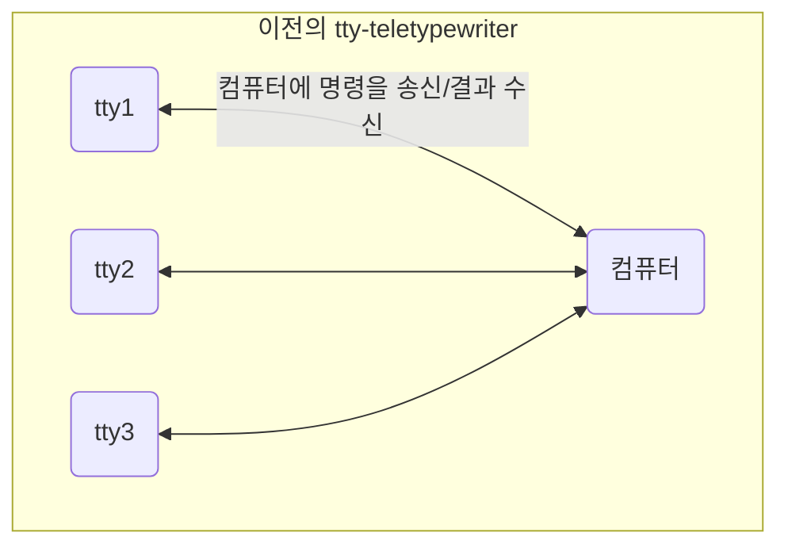

[출처1](https://unix.stackexchange.com/questions/4126/what-is-the-exact-difference-between-a-terminal-a-shell-a-tty-and-a-con?ref=itsfoss.com)
[출처2](https://itsfoss.com/what-is-tty-in-linux/)
[터미널 콘솔 쉘의 차이점](https://blog.naver.com/asianchairshot/221383363419)
# 터미널의 유래
과거 컴퓨터는 대학과 기업이 소유한 거대한 다중 사용자 시스템이었다.
기계 자체는 일반 사용자가 방문하지 않는 안전한 방에 있었다.
**많은 텔레타이프가 하나의 Unix 컴퓨터에 연결되었다.**
모든 사용자는 자신의 텔레타이프 앞에 앉아 자신의 사용자 이름과 비밀번호로 Unix에 로그인했다.
모든 사용자는 자신의 텔레타이프 앞에 앉아 사용자 로그인을 하였다.

텔레프린터를 이용하면 유선으로 문자 메시지를 주고받을 수 있었다.
효과적으로 통신하려면 두 명의 운영자가 필요한 모스 부호 통신을 대체했다.
현대적 레이아웃의 키보드는 없지만 나중에 1901년 donald murray에 의해 시스템이 진화되어 타자기와 유사한 키보드가 포함되었다.
머레이 코드는 운영자가 메시지를 보내는 노력을 줄였다.
이로 인해 1908년 텔레프린터가 상업용 텔레타이프라이터로 진화하는 것이 가능해졌다.
TTY는 그래서 텔레타이프라이터(teletypewriter)의 약자이다.
텔레프라이터는 컴퓨터가 아니지 유선을 통해 컴퓨터와 빠르게 통신할 수 있게 해주는 장치이다.

기술 발전으로 텔레타이프라이터는 전자장치를 사용하여 가상화 되었습니다. 따라서 물리적인 tty 장치가 필요하지 않고 가상의 tty가 필요합니다. 이전 컴퓨터에는 비디오 화면도 없었습니다. 화면에 표시되는 대신(존재하지 않는) 종이에 인쇄되었습니다. 따라서 디스플레이가 아닌 인쇄라는 용어를 사용하는 것을 볼 수 있습니다. 나중에 기술이 발전하며 비디오가 터미널에 추가되었습니다.

즉, 비디오 터미널 또는 물리적 터미널이라고 부를 수도 있습니다.

그리고 이는 향상된 기능과 기능을 갖춘 소프트웨어 에뮬레이트 터미널로 발전하였습니다.
이것을 터미널 에뮬레이터라고 부릅니다. GNOME터미널 또는 konsole은 linux 최고의 터미널입니다..

## 그렇다면 linux에서 tty는 무엇인가?
여기까지 정리를 하면
`tty = terminal = 텍스트의 입/출력 환경`인 것이다.
전자적 관점에서 tty는 terminal
가구적 관점에서 tty는 console이다.
가구적인 teletypewriter
터미널은 정보를 송수신하는 장치인 것이다.
linux에서의 tty는 UNIX 및 Linux의 추상 장치입니다.
직렬 포트와 같은 물리적 입력 장치를 의미하는 경우도 있고, 사용자가 시스템과 상호 작용을 할 수 있는 가상 tty를 의미하는 경우도 있습니다.
# 그럼 쉘(shell)은 무엇인가?
터미널은 정보를 전송하는 메커니즘일 뿐이다.
운영 체제가 정보를 이해하기 위해 터미널은 shell을 기본적으로 사용한다.
shell은 terminal 상에 입력한 명령을 해석하여 운영 체제에서 사용자가 원하는 작업을 이해할 수 있도록 하는 프로그램이다.

***