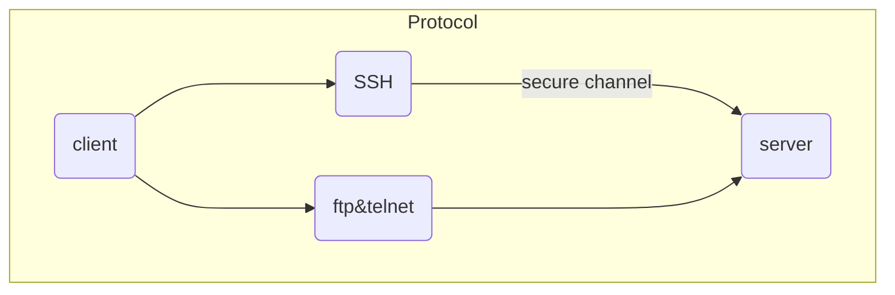

# SSH?
**S**cure **Sh**ell Protocol
**네트워크 프로토콜 중 하나**로, 컴퓨터가 인터넷과 같은 Public Network를 통해 서로 통신을 할 때 보안적으로 안전하게 통신을 하기 위해 사용하는 프로토콜입니다. 
**컴퓨터가 공개 네트워크를 통해 통신을 할 때, 보안적으로 안전하게 통신을 하기 위함이다.**

서버에 접속할 때, 비밀번호 대신 키를 제출하는 방식.

비밀번호보다 높은 수준의 보안을 적용할 수 있고, 로그인 없이 자동으로 서버에 접속할 수 있게 합니다.

대표적인 사용의 예는 다음과 같습니다.
1. 데이터 전송
	+ 깃허브
	  소스 코드를 푸쉬할 때 여러분은 SSH를 활용해 파일을 전송한다.
2. 원격 제어
	+ AWS같은 클라우트 서비스
	  AWS의 서버에 접속하여 해당 머신에 명령을 내리기 위한 SSH 접속
## 왜 SSH를 사용하나?
FTP나 Telnet과 같은 다른 컴퓨터와 통신을 위해 사용되는 프로토콜도 있는데 SSH를 사용할까? 전자의 프로토콜들은 민감한 정보를 주고받으면 네트워크를 통해 넘기기 때문에 누구나 해당 정보를 열어볼 수 있어 보안에 상당해 취약합니다.

