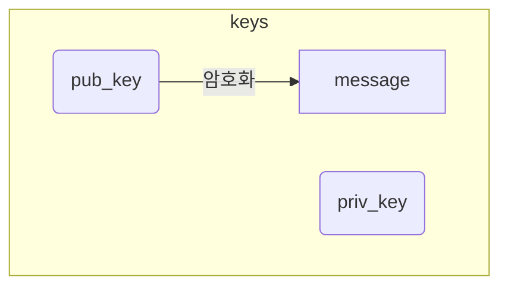
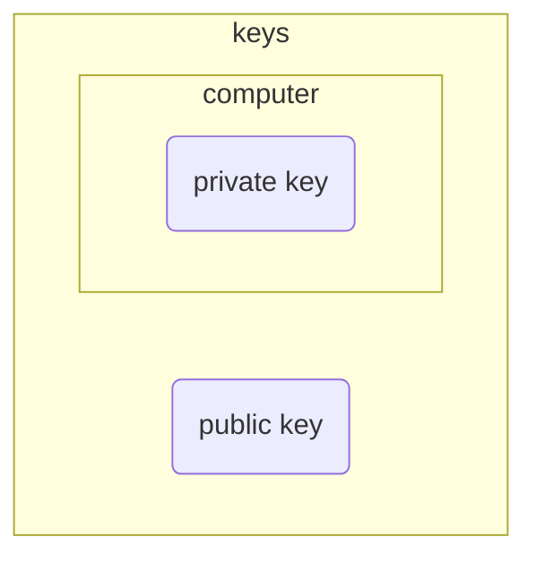
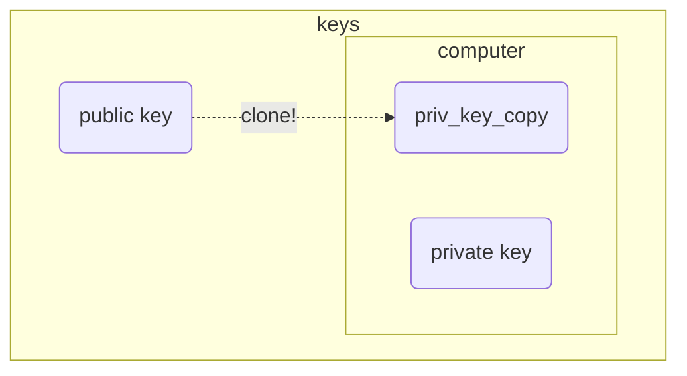

# ssh-key
Public key는 단어 뜻 그래도 공개되어도 비교적 안전한 Key입니다.
이 Pub key는 메시지를 전송하기 전 암호화를 하게 됩니다.
**Pub Key로는 암호화는 가능하지만 복호화는 불가능**합니다.

| keys     | 개인키                  | 공유키              |
| -------- | -------------------- | ---------------- |
|          | Private Key          | Public Key       |
| location | SSH 클라이언트가 설치된 로컬 머신 | SSH 서버가 있는 원격 머신 |
| 파일명      | id_rsa               | id_rsa.pub       |

그리고 이와 쌍을 이루는 Private Key는 절대로 외부에 노출이 되어서는 안되는 Key로 본인의 컴퓨터 내부에 저장하게 되어 있습니다.

이 둘은 수학적인 관계를 맺고 있습니다.
이러한 이유로 priv key와 pub key는 다른 컴퓨터와 통신을 하기 위해서는 먼저 public key를 통신하려고 하는 컴퓨터에 복사하여 저장합니다.

그리고 요청을 보낸 클라이언트 사이드 컴퓨터에서 접속 요청을 할 때 응답을 하는 서버 사이드 컴퓨터에 복사되어 저장된 Public Key와 클라이언트 사이드에 해당 Public Key와 쌍을 이루는 Private Key와 비교하여 서로 한 쌍의 Key인지 아닌지를 검사합니다.
이렇게 서로 Key라는 것이 증명되면 두 컴퓨터 사이에 암호화 채널이 형성되어 Key를 활용해 메시지를 암호화/복호화 하여 데이터를 주고 받습니다.
***
# ssh의 작동원리
SSH의 핵심 키워드는 KEY입니다.
사용자(클라이언트)와 서버(호스트)는 각각의 키를 보유하고 있으며, 이 키를 이용해 연결 상대를 인증하고 안전하게 데이터를 주고 받게 됩니다. 여기서 키를 생성하는 방식이 두 가지가 있습니다.
대칭키와 비대칭키 방식입니다.
## 비대칭키 방식(공개키)
### 공개키 암호의 종류
#### Diffie-Hellman (디프헬만)
  디프헬만의 키 교환 방식은 최초의 공개키 암호 알고리즘입니다.
  공개키 암호 방식의 개념을 이용하여 두 사용자 간에 공통의 암호화키를 안전하게 공유할 수 있는 방법이며 많은 키 분배 방식에 관한 연구의 기본이 되었다.
+ 키 교환 이라 하지만 실제로 공유할 키를 계산하여 제작 (키 합의)
+ 이산대수^[현대컴퓨터가 풀기 어려운 수식을 활용한다.]의 어려움을 기반으로 한 알고리즘
+ 중간자 공격(MITM:man in the middle)에 취약
  = 인증단계가 없기 때문 
+ 중간자 공격을 막기 위해 전자서명과 공개키 인증서 등을 사용
작동하는 순서를 하나하나씩 짚어봅니다.

사용자와 서버가 서로의 정체를 증명해야 하는데 이 시점에서 사용되는 것이 비대칭키 방식입니다. 비대칭키 방식에는 서버 또는 사용자가 Key Pair(키 페어, 키 쌍)를 생성합니다. 키 페어에는 공개 키와 개인 키의 두 가지로 이루어진 한 쌍을 뜻하며, 보통 공개 키의 경우 `.pub`, 개인 키의 경우 `.pem`의 파일 형식을 띕니다.
#### RSA(Rivest Shamir Adleman)
공개키 암호 알고리즘의 사실상 표준
인수분해 문제 해결의 높은 난이도를 이용한 공개키 암호 알고리즘

ex)
1. 사용자가 키 페어를 생성했을 경우
2. 공개 키를 서버에 전송.
   **공개 키는 말그대로 '공개'된 키이기 때문에 누구나 가질 수 있습니다.**
   때문에 전송과정에서 유출되어도 크게 문제가 되지 않습니다.
3. 서버는 공개 키를 받습니다.
   공개 키로 만들어진 랜덤 값을 생성합니다.
   이 값은 사용자가 올바른 키 페어를 가지고 있는지 시험하는 일종의 **시험지**와 같습니다.
4. 시험지를 받은 사용자는 가지고 있는 개인 키를 이용해 이 시험지를 풉니다.
   앞서 말씀드린 것처럼 공개 키와 개인 키는 하나의 커플 관계와도 같기 때문에, 다른 공개 키나 개인 키를 이용해서 풀어낼 수 없습니다.
개인 키는 공개 키와 달리 다른 어디에도 보여주지 않는 소중한 파일입니다. 그래서 결과적으로 개인키가 서버와 사용자 간의 사이를 증명하는 수단이 되는 것입니다.
서버에 공개 키를 전송했고, 공개 키로 암호화되어 제작된 시험지는 오직 공개키로만 풀어낼 수 있고, 그것은 사용자만 가지고 있으니까요.
우리가 그동안 CSP를 이용하면서 서버 생성 시에 제공받았던 pem파일이 바로 이 파일인 것입니다.

다시 과정으로 돌아와서...
5. 시험지를 풀어서 나온 값을 사용자는 다시 서버에 전송합니다.
6. 서버는 사용자로부터 전송받은 값을 자신의 처음에 낸 값과 비교합니다.
7. 두 값이 같으면 이 사용자는 내 공개 키에 대응하는 올바른 개인 키를 보유하고 있으니 내가 아는 사용자가 맞다며 접속을 허용합니다.
8. 이렇게 최초 접속 시 사용자와 서버 간의 인증 절차가 비대칭키 방식을 통해 완료됩니다.
### 약간의 이론..
공개키 방식의 암호는 암호학적으로 연관된 두 개의 키를 만들어 하나는 자기가 안전하게 보관하고 다른 하나는 상대방에게 공개하는 식으로 이루어집니다.
이때 본인만 갖고 있는 키를 개인키라고 하며 상대방에게 공개하는 키는 공개키라고 합니다.
암호화하는 키와 복호화하는 키가 다르므로 **공개키 암호화는 비대칭키 방식 암호화**라고도 합니다.
### 다른 예시
도움이 될지는 모르겠지만 다른 예시를 적어봅니다.
1. 송신자는 수신자의 공개 키를 구합니다.
2. 송신자는 수신자의 공개키로 평문을 암호화합니다.
3. 송신자는 암호화된 메시지를 상대방에게 전달합니다.
   메시지는 암호화되어 있으므로 전달 도중에 유출되거나 도청되어도 암호문으로부터 원문을 알아내기가 어렵습니다.
4. 수신자는 자신의 비밀키로 암호화된 메시지를 해독하여 평문을 얻는다.
#### 요약
**수신자의 공개키로 암호화한 메시지는
수신자의 개인키로 복호화를 할 수 있습니다.**
##### 장점
이는 보안 채널을 구성하는 경우 안전하게 상대방에게 키를 전달할 수 있는 엄청난 장점이 있습니다.
##### 단점
대칭키에 비해 큰 단점..
대칭키에 비해 비교가 되지 않을 정도로 느리다는 점.
전자 서명이나 간단한 메시지 암호화에는 사용할 수 있지만 실시간 암호화 통신 등에는 속도때문에 사용이 힘듬.

이로 인해 암호화 통신 프로토콜에선 암호화에 사용할 대칭키
## 대칭키 방식
서로가 누군지 알았으니 이제 정보를 주고받을 차례입니다. 주고받는 과정에서 새어나가지 않게 정보를 암호화하여 주고받는데, 여기서 사용되는 과정이 대칭키 방식입니다. 대칭키 방식에서는 비대칭키 방식과 달리 한 개의 키만을 사용하는데, 우리는 이것을 대칭키라고 부릅니다.

사용자 또는 서버는 하나의 대칭키를 만들어 서로 공유합니다. 공유된 대칭 키를 이용해 정보를 암호화하면, 받은 쪽에서 동일한 대칭 키로 풀어 정보를 습득하게 됩니다. 정보 교환이 완료되면 교환 당시 썼던 대칭 키는 폐기되고, 나중에 다시 접속할 때마다 새로운 대칭 키를 생성하여 사용하게 됩니다.
***
대칭키
비대칭키
대칭키/비대칭키 혼합
