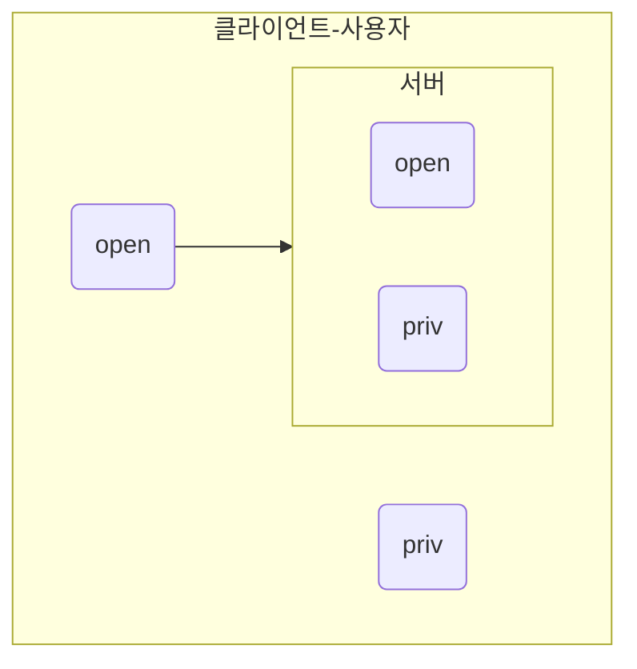

# 가상머신
HV = 하이퍼바이저
VM = 가상머신
가상머신은 하이퍼바이저로 작동을 함.
HV 가상머신을 동작시키는 프로그램
하이퍼바이저가 호스트에게 자원을 써도 되나 물어본다.
cpu 램
호스트의 컴퓨터와 독립적으로 운영체제를 구동 가능하게 도와줌

debian.
# 데비안과 록키
## RH과 CentOS
RHEL 유료버전의 리눅스
RHEL 서비스 하기 위해서 라이선스가 필요.
그 과정에 소스코드를 공개해야함.
그렇게 제작된 OS가 CentOS이다.
CentOS = RH에서 만듬
## 그럼 rocky?
2021년에 CentOS 지원 중단 선언.
이에 반발한 RH의 CentOS 팀원 개발자가 Rocky를 제작함
Rocky RHEL의 버그까지 100%동일하게 구현하도록 노력했음
bug for bug까지 추구를 했다.
### 그럼 rocky는 무료인데..
RHEL 유료인만큼 설치하거나 문제가 발생하면 지원받을 수 있음.
### rocky의 gui?
얘는 기본적으로 gui를 지원함..
tui를 지원하긴 하지만.. 결국 이것도 세팅해줘야 한다.
minimal.iso를 다운받으면 닉값하기 때문에 gui 세팅이 없는 상태이다.
tui 상태라는 뜻.
## 데비안
업데이트 주기가 느림.
그 이유는 안정화를 추구하기 때문임.
그래서 rocky와 debian이 서버와 관련해서 많이 언급되는 이유는 안정성이 둘 다 보장되기 때문임.
rocky와는 다르게 오픈소스로 무료화가 되어있음.

### 데비안, rocky 업데이트
데비안은 덮어쓰는 업데이트
rocky는 그냥 새설치.
+ 그래서 기업에서는 기존의 버전을 유지하며 보수하는 방식을 가짐
# 가상머신의 목적
## 보안
+ 모의 침투를 해볼 수 있다.
+ 바이러스의 테스트
	+ 바이러스를 가상 컴퓨터에 풀어놓음으로 테스팅이 가능하며
	  VM이 오염되어도 OS를 쉽게 설치할 수 있는 이점이 있다.
## 버전 호환성
+ 구동하려는 프로그램이 호스트 컴퓨터의 OS와 호환되지 않는 경우.
# appromor
어플리케이션 권한 관리 프로세스
## MAC mandatory access control
객체가 자원을 관리할 수 있도록 하는 방식.
+ 객체 = 그룹이라고 생각
+ 자원 = 어플리케이션
### 단점
객체에게 권한을 부여하니까.
세세한 권한 관리가 어려움
## DAC
개인
# apt, aptitude
간단한 차이점은..
+ apt = tui를 지원하지 않음
+ aptitude = tui를 지원함
## apt
패키지 관리 툴이다.
apt install lldb
패키지의 설치 삭제 완전삭제가 가능하다.
삭제는 잔여 파일을 상관하지 않고 설치만 삭제함.
purge 옵션 = 잔여 파일도 삭제함.

### 그럼 이거 왜 만듬?
apt-get, apt는 사용자에게 보여주는 정보의 차이가 있다.
설치를 하게 된다면 문제가 발생하였을 때의 메시지 차이도 있음.
apt-get, apt-cache를 대체하기 위해 만들기도 함.
apt = apt-get, apt-cache의 명령어를 담고 있음.
왜?
패키지 관리 툴인데.. 패키지를 관리하기 위해 get, cache를 구분해야 함.
이것이 불편하다.
그래서 apt는 get, cache를 백엔드로 갖고 있기도 함.
## high~low level
그래서 사용자 친화적으로 본다면..
+ aptitude
	+ 패키지의 종속성도 잘 보여줌
+ apt
+ get, cache
+ dpkg
# UFW
복잡하지 않은 방화벽.
닉값하는 이유: 실제로 무식하게 동작함.
싹다 막고 시작함.
그리고 열어줄 수 있는 포트를 정해준다.
# 패스워드 정책의 장점
brutal force(무차별 대입)과 같은 크래킹 툴로부터 보안을 강화할 수 있다.
## 시행 단점
+ 사용자가 비밀번호를 쉽게 생성할 수 없다..
	+ 사용자가 강력한 비밀번호를 설정할 수 있다.

+ 관리자의 입장에서 사용자가 알아서 강력한 패스워드를 만들면 편하다.
# LVM
말그대로 LV를 관리.. 매니지먼트 해줍니다..
## LV
논리 볼륨으로서 유동적으로 볼륨의 크기를 조절할 수 있습니다.

+ sda
	+ sda1
	+ sda2
	+ sda3
+ sdb
	+ sdb1
	+ sdb2
+ sdc

## 왜 LV가 필요한가?
PV물리적인 볼륨은..
아래 디스크가 있다고 가정.
ex)
+ sda (20)
	+ 사용중 = 15
+ sdb (20)
	+ 사용중 = 10
15의 어떤 패키지를 설치하면 안됨..
# SSH
Secure Shell
클라이언트와 서버간의 통신의 담당합니다.
왜 Secure?
암호화 키를 통해서 보안을 지킵니다..

## 비대칭키
1. 클라이언트의 공개키를 서버에 던져준다.
2. 서버에서 클라의 공개키를 통해 시험지를 만든다.
3. 시험지를 클라에게 보낸다.
4. 시험지를 받은 클라는'보안키'로 시험지를 푼다.
   클라의 공개키로 만든 시험지는 클라의 보안키로 풀 수 있기 때문.
**여기까지가 서버, 클라의 최초 접속시 인증 과정**
## 대칭키
1. 최초 인증 후 서로가 한 쌍의 동일한 키를 공유한다.
2. 이렇게 만든 키를 통해 서로에게 정보를 암호화한 시험지를 보냄.
